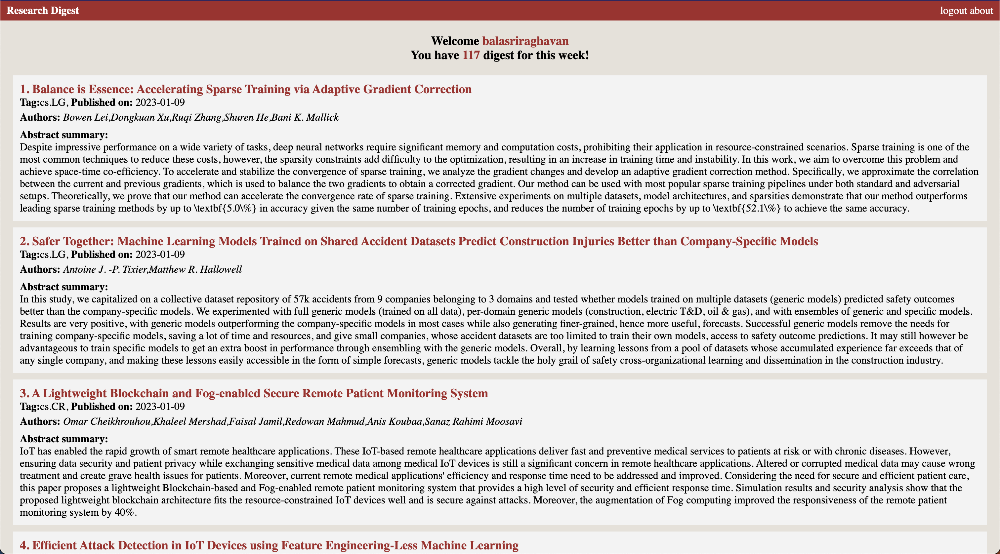

# <b>Research-Digest</b>: Stay upto-date with the Latest Research
An application which is designed to scrape through arXiv each week in search of the newly published papers in the particular fields of 
* cs.CV - Computer Vision
* cs.LG - Machine Learning 
* cs.CL - Computation and Language
* cs.AI - Artificial Intelligence 
* cs.NE - Neural and Evolutionary Computing
* cs.RO - Robotics 
* cs.CR - Cryptography and Security

And offers summarization feature enabling users to understand key points of the papers.



Demo(gif- may take time to load):


## <b>Table of contents</b>
- [Problem Statement](#Problem-statement)
- [Requirements](#Requirements)
- [Getting started](#getting-started)
- [Overview](#Overview)
- [Improvement/bug reports](#improvement/bug-reports)

## <b>Problem Statement</b>
Last year,around 22,000 papers were published about vision transformers!
Keeping track of the research papers in a particular field of study can be a daunting task.

With vast amount of scientific papers published everyday it is difficult to keep up with latest developments in your field of interest.
The fact that researchers work in interdisciplinary fields requiring them to keep track of multiple areas of research.

## <b>Getting started</b>
- Create conda environment
- Install dependencies: ```conda install --file requirements.txt```
- Run it in local server: ```flask run``` (Thinking about further improvements and hosting it in public server)


## <b>Overview</b>
- User friendly interface to select the area of interest and get relavant papers every week.
- Additional summarization feature to quickly understand the key points of paper.
- For summarization, we have **finetuned** a pre-trained model(T5) on scientific articles and stored the weights and tokenizers locally for quick inference. 
- We currently use `cronjob` to scrap papers at frequency of once per 24 hours. And every week on Sunday 11:59 AM the papers stored from scraping are transfered to user databases. Hence when user logs in on Monday he/she is feeded with interested papers that are released on previous week.

## <b>Requirements</b>
- Requirements are mentioned in this [file](requirements.txt).

## <b>Improvement/bug reports</b>
If you encounter any bugs or have any suggestions for improving the application, please feel free to contact us or open an issue on the project's Github page.

## Recognition
We were special mentioned for this project in NIT Trichy Hackathon 2023.


